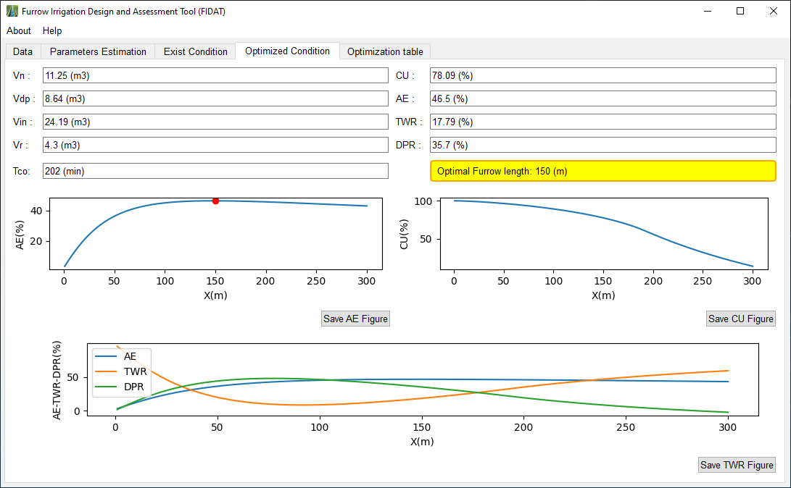
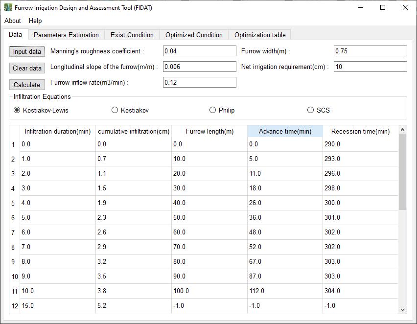

# FIDAT: Furrow Irrigation Design and Assessment Tool

[](https://opensource.org/licenses/MIT)
[](https://www.python.org/downloads/)
[](https://github.com/AmirrezaNemati/FIDAT/graphs/commit-activity)

**FIDAT (Version 1.0)** is comprehensive software designed for the analysis of field conditions, calculation of irrigation efficiency, and optimal design of furrow irrigation systems. Developed using **Python** and **PyQt5**, it bridges the gap between complex hydraulic models and user-friendly application.

## 🚀 Key Features

* **🌊 Real-time Efficiency Assessment:** Takes critical inputs: Furrow width, Net infiltration rate, Manning's roughness coefficient, Land slope, and Input flow.
    * Analyzes parameters to calculate the current **Application Efficiency (Ea)** of the farm instantly.

* **📏 Optimal Design:** * Leverages field data and infiltration equations (Kostiakov, Kostiakov-Lewis, Philip).
    * Determines the **Optimal Furrow Length** that maximizes water use efficiency and minimizes deep percolation/runoff losses.

* **📊 Visualization:** * Generates automated plots for advance/recession curves using Matplotlib.

## 📸 Interface Gallery

### 1. Optimal Design & Visualization
The software automatically calculates the optimal furrow length (highlighted in yellow) and visualizes Advance/Recession curves alongside Efficiency distribution.

<p align="center">
  
</p>

### 2. Data Entry & Model Selection
Users can input field parameters and select from various infiltration models (Kostiakov-Lewis, Philip, SCS, etc.) for precise calibration.

<p align="center">
  
</p>

## 🛠️ Installation & Usage

1.  **Clone the repository:**
    ```bash
    git clone [https://github.com/AmirrezaNemati/FIDAT.git](https://github.com/AmirrezaNemati/FIDAT.git)
    ```
2.  **Install dependencies:**
    ```bash
    pip install -r requirements.txt
    ```
3.  **Run the application:**
    ```bash
    python main.py
    ```

## 🔗 Citation

This software is developed as part of a research project. If you use FIDAT, please refer to:

> **Nemati Mansour, A.**, Raoof, M., & Ostad-Ali-Askari, K. (Under Review). *Introduction and Validation of FIDAT Software for Irrigation Systems Analysis*. Submitted to Scientific Reports.

## 👨‍💻 Developer Information

* **Developer:** Amirreza Nemati Mansour
    * 📧 Email: [amirreza.nemati@ut.ac.ir](mailto:amirreza.nemati@ut.ac.ir)
    * 🔗 [GitHub Profile](https://github.com/AmirrezaNemati)

* **Supervisor:** Dr. Majid Raoof
    * 📧 Email: [majidraoof2000@gmail.com](mailto:majidraoof2000@gmail.com)

---
Licensed under the [MIT License](LICENSE).
